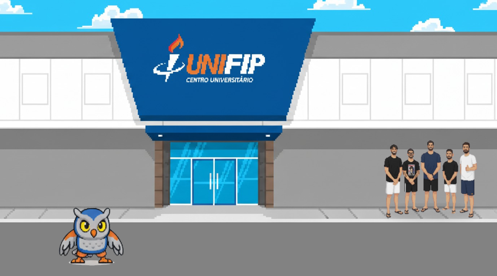

    <h1>Fipinho the Game 🦉</h1>
    

Fipinho, o carismático mascote da FIP, ganha vida em um jogo de luta estilo arcade, onde ele
enfrenta Henriquinho e outras personalidades e símbolos do curso de Análise e
Desenvolvimento de Sistemas em batalhas épicas. Em cenários de estilo cartunesco e colorido,
o jogador controla Fipinho, que possui uma gama de golpes e habilidades especiais que
representam características da faculdade

## Layout do projeto

    

## Tecnologias Utilizadas
<ul>
    <li> Motor de Jogo: Godot
 </li>
    <li> Arte: Canva (para sprites) e Figma (para ajustes de arte e texturas) </li>
    <li>Áudio: Audacity e FL Studio (para criar e editar efeitos sonoros e músicas)
 </li>
</ul>

## Equipe
<ul>
    <li> <a href="https://github.com/henriiqueaze/">Henrique Azevedo</a> </li>
    <li>  <a href="https://github.com/thiagoports/">Thiago Porto</a> </li>
    <li>  <a href="https://github.com/ArthurAkil">Arthur Ákill</a> </li>
    <li>  <a href="https://github.com/joselucasapp">José Lucas</a> </li>
</ul>
